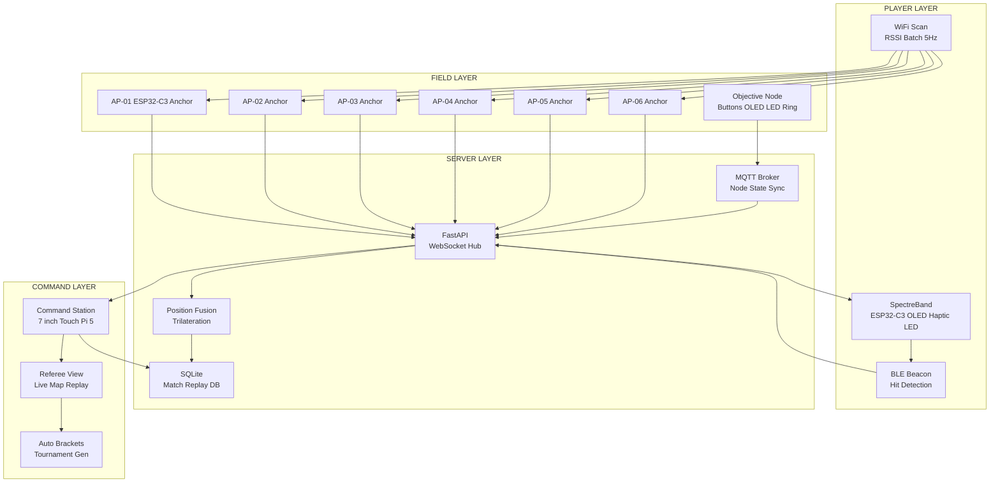
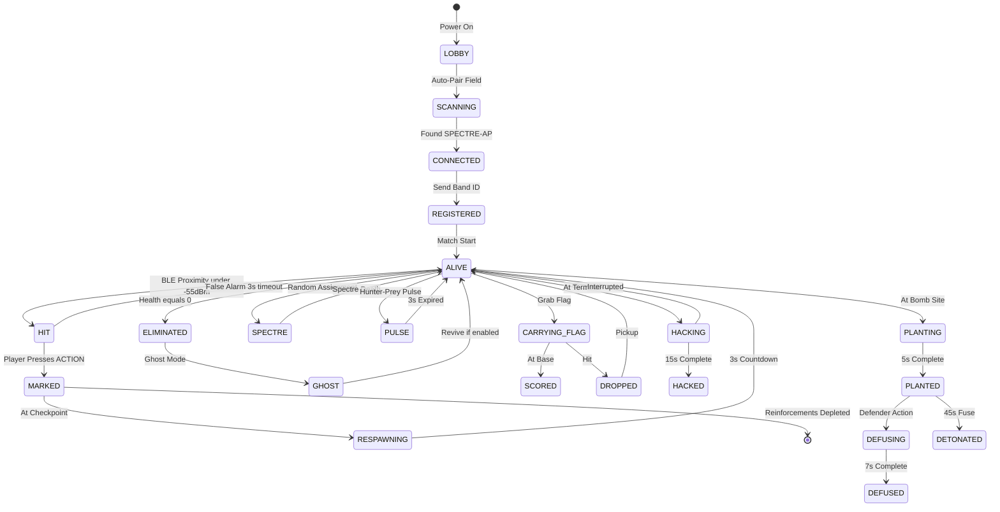
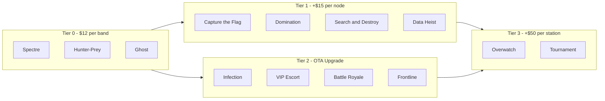
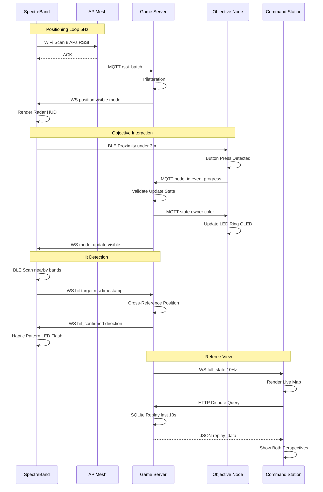
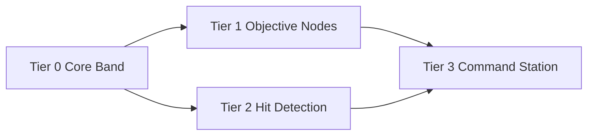

<!--
  SPECTREBAND — Modular Paintball Game System
  ESP32-C3 · BLE Mesh · FastAPI · WebSocket · SQLite
-->

<h1 align="center">SpectreBand</h1>
<p align="center">
  <b>Real-time positioning · Wall-penetrating HUD · 13 game modes · $12/player</b>
</p>

<p align="center">
  
  
  
  
  
</p>

---

## Architecture



---

## Game State Machine



---

## Tier System



---

## Data Flow



---

## Mode Dependency



---

## Quick Start

```bash
# 1. Clone
git clone https://github.com/toxicwind/paintball-field.git
cd paintball-field

# 2. Deploy field server
cd field_server
pip install -r requirements.txt
python server.py --config field_layout.json --mode frontline

# 3. Flash Tier 0 band
cd ../tiers/tier_0_band/firmware
pio run --target upload --environment esp32c3

# 4. Flash Tier 1 objective node
cd ../../tier_1_objective/firmware
pio run --target upload --environment esp32c3
```

---

## Game Modes

| Tier | Cost | Modes |
|------|------|-------|
| **Tier 0** | $12/band | [Spectre](tiers/tier_0_band/modes/spectre/README.md) · [Hunter-Prey](tiers/tier_0_band/modes/hunter_prey/README.md) · [Ghost](tiers/tier_0_band/modes/ghost/README.md) |
| **Tier 1** | +$15/node | [Capture the Flag](tiers/tier_1_objective/modes/capture_flag/README.md) · [Domination](tiers/tier_1_objective/modes/domination/README.md) · [Search & Destroy](tiers/tier_1_objective/modes/search_destroy/README.md) · [Data Heist](tiers/tier_1_objective/modes/data_heist/README.md) |
| **Tier 2** | +$0 (OTA) | [Infection](tiers/tier_2_hitdetect/modes/infection/README.md) · [VIP Escort](tiers/tier_2_hitdetect/modes/vip_escort/README.md) · [Battle Royale](tiers/tier_2_hitdetect/modes/battle_royale/README.md) · [Frontline](tiers/tier_2_hitdetect/modes/frontline/README.md) |
| **Tier 3** | +$50/station | [Overwatch](tiers/tier_3_command/modes/overwatch/README.md) · [Tournament](tiers/tier_3_command/modes/tournament/README.md) |

---

## Hardware BOM

### SpectreBand (Tier 0) — $12/player

| Component | Part | Price | Purpose |
|-----------|------|-------|---------|
| MCU | ESP32-C3-MINI-1 | $2.50 | WiFi + BLE |
| Display | SSD1306 0.96 inch OLED | $1.50 | Radar HUD |
| Haptic | DRV2605L + ERM | $1.00 | Hit alerts |
| LEDs | WS2812B x3 | $0.30 | Team color |
| Battery | 502535 500mAh LiPo | $2.50 | 4hr runtime |
| Charger | MCP73831 + USB-C | $0.70 | Charging |
| PCB/Case/Strap | 30x40mm + TPU + NATO | $2.50 | Wrist-worn |
| Passives | 0402 R/C | $0.50 | Decoupling |
| **Total** | | **$12.00** | |

### Field Kit — $150

| Component | Qty | Unit | Total |
|-----------|-----|------|-------|
| AP Node (ESP32-C3) | 6 | $6 | $36 |
| Server (Raspberry Pi 5) | 1 | $80 | $80 |
| Router (GL.iNet) | 1 | $25 | $25 |
| Enclosures + Power | 6 | $7 | $42 |
| **Total** | | | **$183** |

---

## License

MIT. Build it. Sell it. Run a field.
