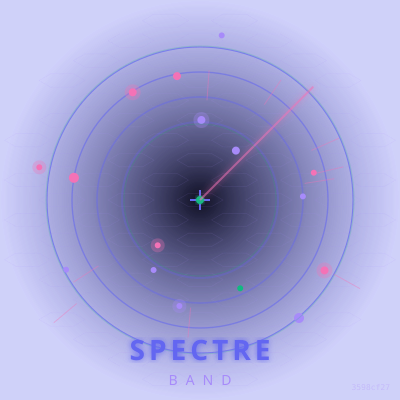

<p align="center">
  
</p>

<h1 align="center">SpectreBand</h1>

<p align="center">
  <b>Wrist-worn radar for paintball.</b><br>
  See your teammates through walls. Capture flags. Hack terminals.<br>
  <i>Like a video game HUD, but real.</i>
</p>

<p align="center">
  
  
  
  
  
</p>

---

## What Is This?

**SpectreBand** is a wristband that shows you where everyone is on the paintball field — even through walls and bunkers.

Each player wears a band with a tiny screen. The screen shows a radar view: **green dots** are your teammates, **red dots** are enemies. Glance at your wrist and you know exactly who's where.

Field owners can add **physical boxes** on the field — flags to capture, bombs to plant, terminals to hack. Players interact with these boxes by pressing buttons. The band vibrates when you get hit. LED lights glow your team color.

It works like a **video game minimap**, but you're actually running around a real field.

---

## Three Ways to Use SpectreBand

### For Field Owners (Make Money)

| What You Get | Cost | What You Charge |
|-------------|------|----------------|
| 8 player bands | ~$100 | $8/player rental = $64/session |
| 6 WiFi anchors + server | ~$150 | Band pays for itself in 2 sessions |
| 3 objective boxes | ~$45 | Players come back for new game modes |

**Total startup: ~$295. First profitable session: session 3.**

Players who love it can buy their own band for $25 and use it at any Spectre-enabled field.

### For Players (Have More Fun)

| Instead of... | You Get... |
|--------------|-----------|
| Walking into ambushes | See enemies through walls for 3 seconds every minute |
| Sitting out when eliminated | Become a "ghost" who spots for your team |
| Same old elimination games | Capture flags, hack terminals, protect VIPs, battle royale |
| Arguing about who got hit | Band vibrates — no debates |

### For Makers (Build Cool Stuff)

- **Open source** — MIT license, hack it, sell it, no lawyers
- **$12 BOM** — ESP32-C3, OLED screen, vibration motor, LEDs
- **13 game modes** — from simple radar to full tournament systems
- **Documented protocols** — add your own hardware, write your own modes

---

## How It Works (Simple Version)

```
┌─────────────┐     WiFi signal      ┌─────────────┐
│   Player    │ ────────────────────> │   Server    │
│   Band      │    (how strong?)      │  (Pi 5)     │
│  (scans)    │                       │  (thinks)   │
└─────────────┘                       └──────┬──────┘
      ^                                      │
      │         Your position +              │
      │         who you can see              │
      └──────────────────────────────────────┘
```

1. **Bands scan WiFi** — 6 small boxes around the field broadcast signals
2. **Server calculates position** — "You're near the left bunker, 15 meters from base"
3. **Server decides what you see** — "Your teammate is behind that wall. Enemy is 8 meters ahead."
4. **Band shows radar** — Tiny screen updates 5 times per second

That's it. No GPS. No phones. No internet. Just a closed WiFi network on your field.

---

## Game Modes

### Start Here (No Extra Hardware)

| Mode | What Happens | Why It's Fun |
|------|-------------|-------------|
| **Hunter-Prey** | Every 60 seconds, everyone sees enemies for 3 seconds | Heart-pounding "pulse" moments |
| **Ghost** | When you die, you become invisible and spot for your team | No sitting out, ever |
| **Spectre** | One player per team sees everyone permanently | Protect your VIP, hunt theirs |

### Add Objective Boxes (+$15 each)

| Mode | What Happens | Why It's Fun |
|------|-------------|-------------|
| **Capture the Flag** | Grab the enemy flag box, run it back | Carrier is visible to everyone — chaos ensues |
| **Domination** | Stand near a box for 10 seconds to capture it | Zone control + intel warfare |
| **Data Heist** | Hack 3 terminals in order while enemies hunt you | Stealth, risk, reward |
| **Search & Destroy** | Plant a bomb, enemies try to defuse it | Tension builds as timer counts down |

### Upgrade Firmware (Free)

| Mode | What Happens | Why It's Fun |
|------|-------------|-------------|
| **Frontline** | Checkpoint respawns, deplete enemy reinforcements | Never truly out, always fighting |
| **Battle Royale** | Safe zone shrinks, last team standing | 32 players, massive chaos |
| **Infection** | One infected player chases survivors | Paranoia + swarm tactics |
| **VIP Escort** | Protect a defenseless player across the field | Coordination test |

### Tournament Kit (+$50)

| Mode | What Happens | Why It's Fun |
|------|-------------|-------------|
| **Overwatch** | One player commands with full map view | Real-time strategy in paintball |
| **Tournament** | Referee tablet validates hits, generates replays | Competitive integrity |

---

## What You Need

### Minimum Setup (~$176, 8 players)

| Item | What It Is | Cost |
|------|-----------|------|
| 8 wristbands | ESP32-C3 + OLED + motor + LEDs + battery | ~$100 |
| 6 WiFi anchors | Small boxes that help triangulate position | ~$36 |
| 1 server | Raspberry Pi 5 (or any old computer) | ~$80 |
| 1 router | Portable WiFi box | ~$25 |

**Total: ~$241** (with enclosures and power)

### Full Setup (~$295, 8 players + objectives)

Add 3 objective boxes ($45) and a charging rack ($52). Now you can run 6 game modes instead of 3.

### Player-Owned Band (~$25)

Players who fall in love with it can buy their own. It works at any field running SpectreBand.

---

## Quick Start

```bash
# 1. Download this repo
git clone https://github.com/toxicwind/paintball-field.git
cd paintball-field

# 2. Start the server (on any computer)
cd server
pip install -r requirements.txt
python src/main.py

# 3. Flash a band (plug in USB, run this)
cd ../firmware/band
pio run --target upload

# 4. Turn on the band near the server
#    It auto-connects. The screen lights up. Play.
```

---

## Case Study: Blitz Paintball

We're piloting SpectreBand at **Blitz Paintball** in Dacono, Colorado. Four fields, four test environments, one real-world proving ground.

| Field | Size | Best For Testing |
|-------|------|-----------------|
| Urban Combat | 60x40m, 200+ bunkers | Multipath interference, accuracy limits |
| Military Base | 50x50m, helicopter + silos | Metal object interference |
| Hyperball | 55x50m, 68 bunkers | Best accuracy, fast games |
| Hyper-Spool | 30x25m, small groups | Pilot testing, beginner friendly |

**Pilot plan**: 8 bands → 3 objective nodes → charging rack → full tournament kit. 5 weeks.

See `fields/blitz_dacono/` for full field configuration.

---

## Technical Details

<details>
<summary><b>Click to expand: For engineers and makers</b></summary>

### Architecture

```
Player Band (ESP32-C3) --WiFi RSSI--> AP Mesh (6x) --MQTT--> Game Server (Pi 5)
  ├── BLE proximity --> Hit detection (player-to-player)
  ├── LoRaWAN --> Long-range hit confirmation / game events
  └── OLED + Haptic + LED <-- WebSocket <-- Server state (5Hz)
```

### Positioning

- **RSSI trilateration** from 6 WiFi anchor points
- **Kalman filter** + **particle filter** fusion for smooth tracking
- **Per-AP calibration** — each anchor learns its own signal propagation
- **Typical accuracy**: 2–3m outdoors, 1–2m on open fields

### Hardware BOM (v1.0)

| Component | Part | Cost | Source |
|-----------|------|------|--------|
| MCU | ESP32-C3-MINI-1 (LCSC C2935306) | $2.92 | LCSC |
| Display | SSD1306 0.96" OLED (LCSC C2890361) | $1.48 | LCSC |
| Haptic | DRV2605L + 10mm ERM (LCSC C527464) | $1.85 | LCSC |
| LEDs | WS2812B x3 (LCSC C114581) | $0.24 | LCSC |
| Battery | 500mAh LiPo | $2.50 | AliExpress |
| Charger | MCP73831T (LCSC C424093) | $0.55 | LCSC |
| **Total** | | **~$12** | |

### Firmware

- **FreeRTOS** on ESP32-C3 dual-core
- **Core 0**: WiFi scan (5Hz), median filter, outlier rejection
- **Core 1**: WebSocket client, OLED render, BLE scan
- **Self-test on boot**: OLED, haptic, LED, battery, AP count

### Server

- **FastAPI** + WebSocket for real-time communication
- **SQLite + WAL** for match logging and replay
- **Simulation mode**: Test without hardware
- **Force eliminate/revive API** for referees

See `REFERENCES.md` for academic citations, datasheets, and vendor links.

</details>

---

## FAQ

**Q: Do players take off their masks to look at the band?**  
A: No. The screen is on your wrist. Glance down — same as checking a watch. Mask stays on.

**Q: Does it work in rain?**  
A: The band case is splash-resistant (IP54). Don't submerge it. The anchor boxes are weatherproof.

**Q: What if someone cheats and doesn't mark their hit?**  
A: The band vibrates when hit. If they ignore it, the referee can force-eliminate them from the tablet. Tournament mode auto-validates hits.

**Q: Can I use this for airsoft or laser tag?**  
A: Yes. The positioning system doesn't care what you're shooting. For laser tag, wire the hit detection to the laser receiver.

**Q: How long does the battery last?**  
A: 4+ hours on a single charge. The charging rack refills all bands overnight.

**Q: Is this legal at my field?**  
A: SpectreBand uses 2.4GHz WiFi — the same as your phone. No special licenses needed. Check with your field's insurance provider.

---

## Contributing

- **Fork it** — add game modes, improve accuracy, design better cases
- **Test it** — run it at your field, report what breaks
- **Sell it** — MIT license means you can build and sell bands commercially

See `AGENTS.md` for internal development notes and `REFERENCES.md` for academic background.

---

## Contact

<p align="center">
  <a href="mailto:denverchrisortega@gmail.com">
    
  </a>
  <a href="https://github.com/toxicwind">
    
  </a>
  <a href="https://resume.effusionlabs.com">
    
  </a>
</p>

**Business inquiries**: Field licensing, bulk orders (50+ bands), white-label solutions  
**Bug reports**: [GitHub Issues](https://github.com/toxicwind/paintball-field/issues)  
**Feature requests**: [GitHub Discussions](https://github.com/toxicwind/paintball-field/discussions)

---

<p align="center">
  <b>Built with 💜 by Christopher Ortega</b><br>
  <a href="mailto:denverchrisortega@gmail.com">denverchrisortega@gmail.com</a> · 
  <a href="https://github.com/toxicwind">github.com/toxicwind</a><br>
  <sub>MIT licensed. Build it, break it, mod it, sell it.</sub>
</p>
