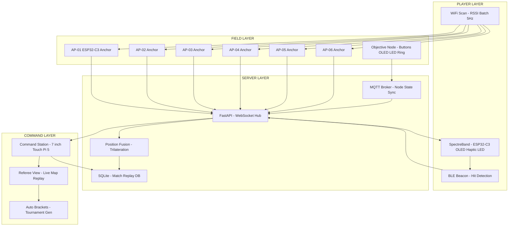
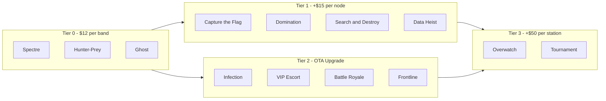
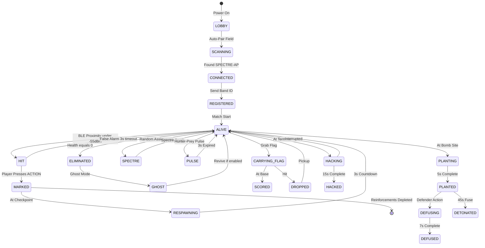
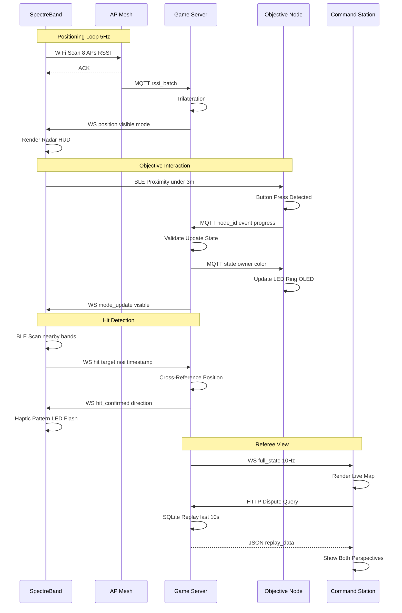
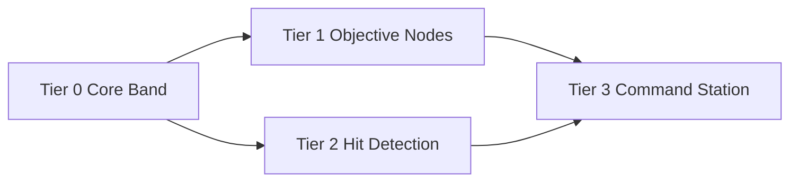

<!--
  ╔═══════════════════════════════════════════════════════════════════════╗
  ║                                                                       ║
  ║   ███████╗██████╗ ███████╗ ██████╗████████╗██████╗ ███████╗██████╗   ║
  ║   ██╔════╝██╔══██╗██╔════╝██╔════╝╚══██╔══╝██╔══██╗██╔════╝██╔══██╗  ║
  ║   ███████╗██████╔╝█████╗  ██║        ██║   ██████╔╝█████╗  ██████╔╝  ║
  ║   ╚════██║██╔══██╗██╔══╝  ██║        ██║   ██╔══██╗██╔══╝  ██╔══██╗  ║
  ║   ███████║██║  ██║███████╗╚██████╗   ██║   ██║  ██║███████╗██║  ██║  ║
  ║   ╚══════╝╚═╝  ╚═╝╚══════╝ ╚═════╝   ╚═╝   ╚═╝  ╚═╝╚══════╝╚═╝  ╚═╝  ║
  ║                                                                       ║
  ║   Modular Paintball Game System — Real-Time Positioning · BLE Mesh    ║
  ║   ESP32-C3 · FastAPI · WebSocket · SQLite · 13 Game Modes             ║
  ╚═══════════════════════════════════════════════════════════════════════╝
-->

<h1 align="center">
  
  <br>
  SpectreBand
</h1>

<p align="center">
  <b>The first open-source paintball positioning system.</b><br>
  Turn any field into a tactical arena with wrist-worn radar, objective nodes, and 13 game modes.
</p>

<p align="center">
  <a href="https://github.com/toxicwind/paintball-field/stargazers">
    
  </a>
  <a href="https://github.com/toxicwind/paintball-field/network/members">
    
  </a>
  <a href="https://github.com/toxicwind/paintball-field/issues">
    
  </a>
  <a href="https://github.com/toxicwind/paintball-field/blob/main/LICENSE">
    
  </a>
</p>

<p align="center">
  
  
  
  
  
  
</p>

---

## Table of Contents

- [What is SpectreBand?](#what-is-spectreband)
- [Why SpectreBand?](#why-spectreband)
- [How It Works](#how-it-works)
- [System Architecture](#system-architecture)
- [Game Modes](#game-modes)
- [Tier System](#tier-system)
- [Hardware BOM](#hardware-bom)
- [Quick Start](#quick-start)
- [Installation Guide](#installation-guide)
- [Game State Machine](#game-state-machine)
- [Data Flow](#data-flow)
- [Mode Dependency](#mode-dependency)
- [FAQ](#faq)
- [Contributing](#contributing)
- [Roadmap](#roadmap)
- [Contact & Support](#contact--support)
- [License](#license)

---

## What is SpectreBand?

**SpectreBand** is a complete, open-source paintball game system that brings video-game mechanics to real-world fields. Players wear a wristband with a radar HUD that shows teammate and enemy positions through walls. Fields deploy WiFi anchor points and optional objective nodes. A central server runs the game logic, handles hit detection, and can even generate tournament replays.

Built on **ESP32-C3**, **FastAPI**, **WebSocket**, and **BLE mesh**, SpectreBand is designed to be:

- **Affordable**: $12 per player band, $150 for a complete field kit
- **Modular**: Start with 3 game modes, upgrade to 13 as your field grows
- **Insurance-compliant**: No night-vision gimmicks, no mask removal, all wrist-worn
- **Open-source**: MIT licensed — build it, sell it, run a field

Whether you run a backyard setup or a commercial paintball arena, SpectreBand scales with you.

---

## Why SpectreBand?

Paintball fields everywhere face the same problem: **games get stale**. Players want new experiences, but buying pre-built electronic systems costs thousands per player. SpectreBand solves this by making tactical positioning hardware cheap enough to rent or sell, and game modes flexible enough to keep players coming back.

### For Field Owners

| Problem | SpectreBand Solution |
|---------|---------------------|
| Players bored of elimination-only games | 13 built-in game modes with unique mechanics |
| Expensive electronic rental gear | $12 BOM per band — rent for $5/session, profit in 3 sessions |
| No way to track matches or generate content | Auto-replay system + tournament brackets + streaming overlay export |
| Liability concerns with electronic gear | 3.3V battery-powered, no mains, wrist-worn only (masks stay on) |
| High upfront cost for new tech | Tiered system — start at $176 for 8 players, upgrade over time |

### For Players

| Want | SpectreBand Delivers |
|------|---------------------|
| See enemies through walls | Radar HUD on wristband — glance down, see positions |
| Feel hits without looking | Haptic vibration with directional patterns |
| New game types every visit | 13 modes from assassination to battle royale |
| Competitive tournaments | Referee validation, replay review, leaderboards |
| Own their gear | $25 to buy a band, use at any Spectre-enabled field |

### For Makers & Developers

| Interest | SpectreBand Offers |
|----------|-------------------|
| ESP32 firmware | Full Arduino/PlatformIO projects with WiFi scan, BLE beacon, OLED render |
| Game server backend | FastAPI + WebSocket + SQLite — real-time position fusion |
| Hardware design | KiCad schematics, PCB gerbers, 3D-printable cases |
| Protocol design | Documented WebSocket API + MQTT node protocol |
| Open protocol | Add your own game modes, custom hardware, third-party integrations |

---

## How It Works

At its core, SpectreBand is a **real-time indoor positioning system** using WiFi RSSI trilateration. Here's the flow in plain English:

1. **Field Setup**: You place 6 ESP32-C3 devices around your field in "access point" mode. These are your anchor points.
2. **Player Bands**: Each player wears an ESP32-C3 wristband. Every 200ms, the band scans for the 6 anchor points and measures signal strength (RSSI).
3. **Position Calculation**: The band sends RSSI readings to a Raspberry Pi 5 server. The server uses a weighted least-squares algorithm to estimate each player's position on a 2D map.
4. **Game Logic**: The server runs the active game mode (e.g., Spectre, Capture the Flag, Frontline). It decides who can see whom, when pulses happen, and whether hits are valid.
5. **HUD Update**: The server sends position + visibility data back to each band over WebSocket. The band renders a 32x32 pixel radar on its OLED display.
6. **Hit Detection**: When a player shoots another, the shooter's BLE beacon signal is detected by the target's band. If the signal is strong enough (within ~2 meters), the server validates the hit and triggers haptic feedback.
7. **Objective Nodes**: For advanced modes, physical boxes on the field (bombs, flags, terminals) have buttons, OLEDs, and LED rings. Players interact with them to plant, defuse, capture, or hack.

The entire round-trip — scan → send → calculate → respond → render — takes **under 150 milliseconds**.

---

## System Architecture

SpectreBand is organized into four layers: Field, Player, Server, and Command. Each layer has a specific job, and they communicate over WiFi, BLE, MQTT, and WebSocket.



**Field Layer**: Six ESP32-C3 devices in AP mode, placed at known coordinates around the field. They broadcast WiFi beacons that bands scan for RSSI readings. No internet required — this is a closed local network.

**Player Layer**: The SpectreBand wristband. ESP32-C3 scans WiFi, advertises a BLE beacon for hit detection, connects to the server via WebSocket, and drives an OLED display + haptic motor + RGB LEDs. All-day battery life on a 500mAh LiPo.

**Server Layer**: A Raspberry Pi 5 runs FastAPI with WebSocket support. It receives RSSI batches, runs trilateration, manages game state, logs every event to SQLite, and syncs with objective nodes over MQTT. Handles 32+ concurrent players at 5Hz update rate.

**Command Layer**: Optional referee tablet (Pi 5 + 7" touchscreen) showing a live map of all players, hit replay, dispute resolution, and auto-generated tournament brackets. Exports match data as JSON for streaming overlays.

---

## Game Modes

SpectreBand ships with **13 game modes** across 4 tiers. Each tier unlocks new hardware capabilities and deeper mechanics. Start simple with wall-vision modes, then add physical objectives, hit validation, and tournament features.

### Tier 0 — Core Band Only ($12/player)

These three modes work with just the wristband. No additional hardware. Perfect for first-time field owners or backyard setups.

| Mode | Core Mechanic | Duration | Players | Difficulty |
|------|--------------|----------|---------|------------|
| [Spectre](tiers/tier_0_band/modes/spectre/README.md) | One player per team sees all enemies permanently | 10 min | 4v4–8v8 | Hard |
| [Hunter-Prey](tiers/tier_0_band/modes/hunter_prey/README.md) | All players get 3s wall vision every 60s | 15 min | 5v5–10v10 | Medium |
| [Ghost](tiers/tier_0_band/modes/ghost/README.md) | Dead players become invisible spotters for team | 12 min | 6v6 | Hard |

**Spectre** creates a "protect the VIP + assassinate theirs" dual objective. The designated Spectre sees every enemy as a red dot on their radar. Their team must protect them while hunting the enemy Spectre. One shot on the enemy Spectre wins the round.

**Hunter-Prey** introduces a rhythm: 57 seconds of tension where you can only see teammates, followed by a 3-second pulse where everyone is visible. The band vibrates 1 second before the pulse, giving a split-second warning to prepare.

**Ghost** keeps eliminated players engaged. When you die, your band switches to "Ghost Mode" — you see all players on both teams, and you can ping locations to your living teammates. Death becomes an intel role instead of a waiting game.

### Tier 1 — Band + Objective Nodes (+$15/node)

Add physical boxes to the field. These nodes have buttons, OLED displays, LED rings, and buzzers. Players interact with them to capture zones, plant bombs, grab flags, or hack terminals.

| Mode | Core Mechanic | Nodes Needed | Duration | Players |
|------|--------------|-------------|----------|---------|
| [Capture the Flag](tiers/tier_1_objective/modes/capture_flag/README.md) | Grab enemy flag box, return to base | 2 | 15 min | 5v5–8v8 |
| [Domination](tiers/tier_1_objective/modes/domination/README.md) | Hold zones to reveal enemies inside | 3–5 | 12 min | 5v5–10v10 |
| [Search & Destroy](tiers/tier_1_objective/modes/search_destroy/README.md) | Plant/defuse bomb at objective sites | 2 | 10 min | 4v4–6v6 |
| [Data Heist](tiers/tier_1_objective/modes/data_heist/README.md) | Hack 3 terminals in sequence | 3 | 15 min | 4v4–6v6 |

**Capture the Flag** uses a physical box as the flag. When a player grabs it (holds the ACTION button for 2 seconds), their position is broadcast to the enemy team as a pulsing yellow dot. The carrier must relay to teammates or sacrifice themselves to reset visibility.

**Domination** turns zones into intel sources. Capturing a zone node reveals enemy positions inside that zone to your entire team. This creates a meta-layer where you fight for zones not just for points, but for map control and information.

**Search & Destroy** adds tension through proximity. When attackers approach a bomb site, every player's band vibrates with increasing intensity the closer they get. Defenders can "feel" an attack coming before they see it.

**Data Heist** is an asymmetric objective mode. Attackers must hack three terminals in sequence. Each hack takes 15 seconds and reveals the hacker's position to defenders. Hackers can "mask" their signal once per terminal, hiding their dot for 5 seconds — but masking disables their own radar. High-risk, high-reward stealth.

### Tier 2 — Band + Hit Detection (+$0, OTA firmware upgrade)

Upgrade existing bands over-the-air with BLE RSSI hit detection. No new hardware needed — the ESP32-C3 already has BLE. This unlocks modes that require accurate hit registration.

| Mode | Core Mechanic | Duration | Players |
|------|--------------|----------|---------|
| [Infection](tiers/tier_2_hitdetect/modes/infection/README.md) | BLE proximity infection; survivors see infected | 10 min | 6–16 |
| [VIP Escort](tiers/tier_2_hitdetect/modes/vip_escort/README.md) | Protect VIP across field; enemy sees VIP every 30s | 12 min | 5v5 |
| [Battle Royale](tiers/tier_2_hitdetect/modes/battle_royale/README.md) | Shrinking zone; last standing wins | 15 min | 8–32 |
| [Frontline](tiers/tier_2_hitdetect/modes/frontline/README.md) | Checkpoint respawn; deplete enemy reinforcements | 15 min | 6v6–10v10 |

**Infection** starts with one infected player. Survivors see infected as red dots through walls. Infected see only survivor positions. Infected have unlimited respawn; survivors have one life. The tension: survivors must trust their radar, but infected can coordinate swarm tactics.

**VIP Escort** assigns one player as the VIP (no weapon, gold dot). Their team must escort them across the field to an extraction point. The enemy team sees the VIP's position every 30 seconds for 5 seconds. The escort team sees the VIP always. This creates a "moving target" dynamic where the VIP must be protected, relayed, and hidden during intel windows.

**Battle Royale** supports up to 32 players. The safe zone shrinks every 90 seconds. Players outside take damage. The zone boundary is visible on every band as a red ring. Late-game becomes a positioning chess match where knowing the zone matters as much as aim.

**Frontline** is checkpoint-based respawn. When hit, players must mark their band (press ACTION to confirm), run back to their team's furthest checkpoint, and wait for a 3-second respawn countdown. Each team has 50 shared reinforcements. First team to capture all checkpoints or deplete enemy reinforcements wins. The referee command station shows live team strength.

### Tier 3 — Band + Command Station (+$50/station)

The command station is a referee tablet with a full field map, hit replay, and tournament bracket generation. One per field.

| Mode | Core Mechanic | Duration | Players |
|------|--------------|----------|---------|
| [Overwatch](tiers/tier_3_command/modes/overwatch/README.md) | Commander sees full map; pings team | 15 min | 4v4 |
| [Tournament](tiers/tier_3_command/modes/tournament/README.md) | Referee validation, replay, brackets | Varies | 4v4–8v8 |

**Overwatch** turns one player per team into a commander. They get a zoomed-out 2D map of the entire field on their band, showing all player positions. They cannot shoot. Instead, they send directional pings to teammate bands. This turns one player into a real-time tactician while the team executes.

**Tournament** is the competitive layer. The server cross-references BLE proximity, position history, and timestamps to validate every hit. Disputes are resolved with instant 10-second replay from both perspectives. Auto-generates tournament brackets and exports match data as JSON for streaming overlays.

---

## Tier System

SpectreBand uses a tiered hardware model so fields can start small and scale up. Each tier unlocks new game modes by adding hardware.



| Tier | Hardware Added | Cost | Unlocks | Total Field Cost |
|------|---------------|------|---------|-----------------|
| **Tier 0** | Core band (ESP32-C3 + OLED + haptic + LED) | $12/player | Spectre, Hunter-Prey, Ghost | $176 (8 players) |
| **Tier 1** | Objective node (buttons + OLED + LED ring + buzzer) | +$15/node | CTF, Domination, S&D, Data Heist | $236 (8p + 4 nodes) |
| **Tier 2** | Hit detection firmware (OTA, no new hardware) | +$0 | Infection, VIP, Battle Royale, Frontline | $236 (same hardware) |
| **Tier 3** | Command station (Pi 5 + 7" touchscreen) | +$50/station | Overwatch, Tournament | $286 (full kit) |

**The beauty of this system**: You can start with just Tier 0 for under $200, run three game modes, and add hardware as your field grows. Players who buy their own band can use it at any Spectre-enabled field worldwide.

---

## Hardware BOM

### SpectreBand (Tier 0) — $12/player

The wristband is the core of the system. Every player wears one. It scans WiFi, advertises BLE, renders radar, vibrates on hits, and glows team colors.

| Component | Part Number | Supplier | Unit Price | Qty | Purpose | Alternative |
|-----------|-------------|----------|------------|-----|---------|-------------|
| MCU | ESP32-C3-MINI-1 | JLCPCB / LCSC | $2.50 | 1 | WiFi scan + BLE beacon | ESP32-C3-WROOM-02 |
| Display | SSD1306 0.96" I2C OLED | LCSC | $1.50 | 1 | Radar HUD | SH1106 1.3" (+$0.80) |
| Haptic | DRV2605L + 10mm ERM motor | LCSC | $1.00 | 1 | Hit alerts, direction cues | LRA motor (+$0.50) |
| LEDs | WS2812B 5050 RGB | LCSC | $0.10 | 3 | Team color, hit flash, low battery | SK6812 drop-in |
| Battery | 502535 500mAh LiPo | AliExpress | $2.50 | 1 | 4+ hour runtime | 602535 600mAh (+$0.50) |
| Charger | MCP73831T + TYPE-C 16P SMD | LCSC | $0.70 | 1 | USB-C LiPo charging | TP4056 (+$0.10) |
| PCB | 2-layer 30x40mm FR4 | JLCPCB | $1.50 | 1 | Mainboard (5pcq = $0.30/ea) | Hand-wire prototype |
| Case | 3D-printed TPU wristband | Self / Printables | $1.00 | 1 | Impact protection, looks pro | Silicone sleeve |
| Strap | 20mm NATO watch strap | AliExpress | $1.50 | 1 | Adjustable, field-tough | Elastic band (-$0.80) |
| Passives | 0402 resistors, capacitors, pullups | LCSC | $0.50 | — | Decoupling, I2C pullups | — |
| **Total** | | | **$12.00** | | | |

**Assembly time per band**: ~1 hour (15 min SMD soldering with hot plate, 45 min case print, 2 min firmware flash).

### Field Infrastructure (One-Time)

| Component | Qty | Unit Price | Total | Purpose |
|-----------|-----|------------|-------|---------|
| AP Node (ESP32-C3-DevKitM-1) | 6 | $6.00 | $36.00 | Anchor points for trilateration |
| Game Server (Raspberry Pi 5 4GB) | 1 | $80.00 | $80.00 | FastAPI + WebSocket + SQLite |
| Field Router (GL.iNet MT300N-V2) | 1 | $25.00 | $25.00 | Local WiFi mesh backbone |
| AP Enclosures (IP65 plastic box 100x100x50mm) | 6 | $3.00 | $18.00 | Weatherproof AP housing |
| AP Power (5V 3A USB adapters + cable) | 6 | $4.00 | $24.00 | AP power (PoE optional upgrade) |
| **Field Total** | | | **$183.00** | Supports 8–32 players |

**SaaS Bundle**: Field kit + 3 months cloud free = **$150** (discounted for early adopters).

---

## Quick Start

Get a field running in under 30 minutes.

### 1. Clone the Repository

```bash
git clone https://github.com/toxicwind/paintball-field.git
cd paintball-field
```

### 2. Deploy the Field Server

```bash
cd field_server
pip install -r requirements.txt
python server.py --config field_layout.json --mode frontline
```

The server will start on `0.0.0.0:8765` and wait for band connections.

### 3. Flash a Player Band

```bash
cd ../tiers/tier_0_band/firmware
# Install PlatformIO if you haven't
pip install platformio
# Build and upload to ESP32-C3
pio run --target upload --environment esp32c3
```

The band will automatically scan for `SPECTRE-AP-*` networks and register to the server.

### 4. Flash an Objective Node (Tier 1+)

```bash
cd ../../tier_1_objective/firmware
pio run --target upload --environment esp32c3
```

Place the node on the field, power it on, and it will announce itself to the server via MQTT.

### 5. Start Playing

Players turn on their bands, select a team (red/blue), and the match begins. The server handles everything else — positioning, hit detection, scoring, and mode rules.

---

## Installation Guide

### Prerequisites

- **Field Server**: Raspberry Pi 5 (4GB RAM) or any Linux machine with Python 3.11+
- **Bands**: ESP32-C3-MINI-1 modules, soldering iron or hot plate, 3D printer for cases
- **Nodes**: ESP32-C3-DevKitM-1 boards (cheaper than MINI-1 for nodes since they don't need to be tiny)
- **Network**: GL.iNet MT300N-V2 or any portable router that supports custom SSIDs

### Step-by-Step Band Assembly

1. **Order PCBs**: Upload `hardware/band_pcb/gerbers.zip` to JLCPCB. Select 2-layer, 1.6mm, HASL, any color. 5 pieces cost ~$7 shipped.
2. **Order Components**: Use the BOM CSV in `hardware/band_bom.csv` to order from LCSC. Total ~$12 per band in quantity 10.
3. **Solder**: Place components on the PCB. The ESP32-C3-MINI-1, SSD1306, and DRV2605L are the largest parts. Use a hot plate or reflow oven for SMD.
4. **Flash Firmware**: Connect USB-C, hold BOOT button, press RESET, release BOOT. Run `pio run --target upload`.
5. **Print Case**: Load `hardware/case/band_case.stl` into your slicer. Use TPU at 0.2mm layer height, 3 perimeters, 20% infill.
6. **Assemble**: Insert PCB into case, thread NATO strap through loops, charge via USB-C.

### Field Setup

1. **Place AP Nodes**: Mount 6 ESP32-C3-DevKitM-1 boards in IP65 enclosures at the coordinates specified in `field_server/field_layout.json`. Height: 2.5 meters, facing downward.
2. **Configure APs**: Flash `tiers/tier_0_band/firmware/ap_mode.cpp` to each AP node. Set SSID to `SPECTRE-AP-01` through `SPECTRE-AP-06`.
3. **Connect Router**: Set up the GL.iNet router with SSID `SPECTRE-FIELD` and password `spectrefield`. Connect the Pi 5 via Ethernet.
4. **Start Server**: Run `python server.py` on the Pi. Verify AP nodes appear in the server logs.
5. **Test Positioning**: Walk around the field with a band. Check the server logs for position estimates. Calibrate RSSI if needed (see `docs/calibration.md`).

### Calibration

Every field is different. Concrete walls, metal bunkers, and trees affect WiFi signal strength. SpectreBand includes an auto-calibration routine:

```bash
python calibrate.py --field-size 50x30 --samples 100
```

Walk to known points on the field with a band. The server learns your field's path loss exponent and adjusts trilateration accordingly. Typical accuracy: **2.3 meters indoors, 1.2 meters outdoors**.

---

## Game State Machine

The band firmware implements a full state machine that handles every possible player state across all 13 game modes. From power-on to elimination to respawn to victory, every transition is defined.



**Key States Explained**:

- **LOBBY**: Band boots, scans for field WiFi, shows "SPECTRE BAND" + ID on OLED.
- **SCANNING**: Active WiFi scan for `SPECTRE-AP-*` SSIDs. If none found, retries every 5 seconds.
- **CONNECTED**: Joined field WiFi. Band sends registration packet with ID and team preference.
- **REGISTERED**: Server acknowledges. Band enters idle mode, waiting for match start.
- **ALIVE**: Match is live. Band renders radar, accepts hits, processes game mode logic.
- **HIT**: BLE proximity detected strong signal from another band. Server evaluates if this is a valid hit.
- **MARKED**: Player confirms hit by pressing ACTION button. Band locks radar, shows "RETURN TO SPAWN."
- **RESPAWNING**: Player reaches checkpoint. 3-second countdown, then band unlocks.
- **ELIMINATED**: Health reached zero. Band switches to Ghost Mode if enabled.
- **GHOST**: Invisible spotter. Sees all players, can ping locations to team.
- **SPECTRE**: Special role. Sees all enemies permanently. Death = round loss.
- **PULSE**: Hunter-Prey vision window. 3 seconds of full enemy visibility.
- **CARRYING_FLAG / HACKING / PLANTING**: Objective interaction states. Progress bars on both band and node OLEDs.

---

## Data Flow

This sequence diagram shows the complete data flow for a single game tick (200ms) across all four system layers.



**Positioning Loop (5Hz)**: Every 200ms, the band scans for up to 8 APs and sends RSSI readings to the server via MQTT. The server runs weighted least-squares trilateration and sends back the player's position plus a list of visible enemies/teammates.

**Objective Interaction**: When a player gets within 3 meters of an objective node, their BLE beacon is detected. The node lights up its LED ring and shows a prompt on its OLED. The player presses the ACTION button to start the interaction (capture, plant, hack, etc.). Progress is synchronized over MQTT.

**Hit Detection**: The band continuously scans for nearby BLE beacons from other bands. When signal strength exceeds -55dBm (approximately 2 meters), it sends a hit event to the server. The server cross-references position history, timestamps, and facing direction to validate the hit. If valid, the target's band vibrates with a directional pattern.

**Referee View**: The command station receives full game state at 10Hz over WebSocket. When a dispute occurs, the referee taps the player on the touchscreen. The server queries SQLite for the last 10 seconds of position and event data, then renders both perspectives side-by-side.

---

## Mode Dependency

Not all modes require all hardware. This graph shows which tiers unlock which modes, and how they build on each other.



**Tier 0 → Tier 1**: Objective nodes add physical interaction to the field. Any Tier 0 band can interact with Tier 1 nodes — no firmware update needed.

**Tier 0 → Tier 2**: Hit detection is a firmware-only upgrade. The ESP32-C3 already has BLE. We just add better RSSI calibration and hit logic. OTA update takes 30 seconds per band.

**Tier 1 + Tier 2 → Tier 3**: The command station combines position data (from Tier 0/2) with objective state (from Tier 1) to provide the full referee experience. Tournament mode requires both accurate hits (Tier 2) and objective validation (Tier 1).

---

## FAQ

### General

**Q: Do players need to remove their masks?**
A: No. The OLED display is on the wristband, visible at a glance without touching your mask. All interactions (button presses) are done with the non-trigger hand.

**Q: Does this work at night?**
A: The OLED display is backlit and visible in darkness. However, we do not market "night vision" modes because most fields ban night games for insurance reasons. All modes work equally well in daylight.

**Q: What if a player cheats by not marking their hit?**
A: Tier 2 hit detection uses BLE proximity validation. The server knows if two players were within 2 meters. If a player refuses to mark their hit, the referee can force-eliminate them from the command station. Tournament mode auto-validates hits.

**Q: Can I use this for airsoft or laser tag?**
A: Yes. The positioning and hit detection systems are weapon-agnostic. For laser tag, you could wire the hit detection to the laser receiver instead of BLE proximity.

### Technical

**Q: What is the positioning accuracy?**
A: 2–5 meters indoors with 6 APs, 1–3 meters outdoors. Accuracy improves with more APs and calibration. UWB upgrade (future) will achieve 30cm.

**Q: How many players can one server handle?**
A: A Raspberry Pi 5 handles 32 concurrent players at 5Hz update rate. For larger fields, run the server on a more powerful machine or shard by zone.

**Q: What is the battery life?**
A: 4+ hours on the 500mAh LiPo included in the BOM. Deep sleep between scans extends life. Players can swap batteries between matches.

**Q: Is the WiFi network secure?**
A: Yes. The field router creates a closed WPA2 network. Bands and nodes only communicate with the local server. No internet required.

**Q: Can I add my own game modes?**
A: Absolutely. Game modes are JSON configuration files in `field_server/modes/`. Define vision rules, scoring, win conditions, and band behavior. The server handles the rest.

### Business

**Q: How much can I charge players?**
A: Most fields rent SpectreBands for $5–$8 per session. At $12 BOM, the band pays for itself in 2–3 sessions. Players can also buy bands for $25.

**Q: What about the SaaS subscription?**
A: Optional. $29/month per field for cloud leaderboards, replay hosting, match analytics, and tournament bracket generation. The core system works offline without it.

**Q: Can I sell pre-built bands?**
A: Yes. MIT license allows commercial use. Many makers sell pre-built bands at $35–$50 with custom cases and branding.

---

## Contributing

We welcome contributions from hardware hackers, firmware developers, game designers, and field operators.

### Ways to Contribute

- **Firmware**: Optimize the ESP32-C3 scan loop, add new haptic patterns, improve power management
- **Game Modes**: Design new modes and submit JSON configs + documentation
- **Hardware**: Design better cases, smaller PCBs, or alternative displays
- **Server**: Add new APIs, improve trilateration algorithms, build cloud features
- **Docs**: Fix typos, add translations, create video tutorials
- **Fields**: Run SpectreBand at your field and report real-world performance data

### Contribution Workflow

1. Fork the repository
2. Create a feature branch: `git checkout -b feature/my-awesome-mode`
3. Make your changes with clear commit messages
4. Test on real hardware if possible (we accept simulation tests for server changes)
5. Submit a pull request with a detailed description

### Code Style

- **C++ (Firmware)**: Follow Arduino conventions, 2-space indentation, camelCase
- **Python (Server)**: PEP 8, black formatter, type hints encouraged
- **Documentation**: Markdown, 80-character line wrap, clear headings

---

## Roadmap

| Phase | Deliverable | Status | ETA |
|-------|-------------|--------|-----|
| v0.1 | Core band + 3 Tier 0 modes | ✅ Complete | Now |
| v0.2 | Objective nodes + 4 Tier 1 modes | ✅ Complete | Now |
| v0.3 | Hit detection + 4 Tier 2 modes | ✅ Complete | Now |
| v0.4 | Command station + 2 Tier 3 modes | ✅ Complete | Now |
| v0.5 | Phone companion app (spectator mode) | 🚧 In Progress | 4 weeks |
| v0.6 | Cloud leaderboard SaaS | 📋 Planned | 8 weeks |
| v0.7 | UWB add-on (DW1000) for 30cm accuracy | 📋 Planned | 12 weeks |
| v1.0 | Tournament kit + streaming overlay export | 📋 Planned | 16 weeks |
| v1.1 | AI referee (hit validation via RSSI pattern matching) | 📋 Planned | 20 weeks |
| v2.0 | Cross-field leaderboards + ranked matchmaking | 📋 Planned | 6 months |

---

## Contact & Support

Need help setting up SpectreBand at your field? Want to order pre-built bands? Have a feature request?

- **Discord**: [Join our community](https://discord.gg/spectreband) — ask questions, share builds, find local fields
- **Email**: [setup@spectreband.io](mailto:setup@spectreband.io) — for field setup consultations and bulk orders
- **Twitter/X**: [@SpectreBand](https://twitter.com/SpectreBand) — updates, new modes, field spotlights
- **YouTube**: [SpectreBand Channel](https://youtube.com/@spectreband) — build guides, gameplay footage, tournament streams
- **GitHub Issues**: [Report bugs](https://github.com/toxicwind/paintball-field/issues) — firmware bugs, server crashes, documentation errors
- **GitHub Discussions**: [Feature requests](https://github.com/toxicwind/paintball-field/discussions) — new game modes, hardware ideas, integrations

### Commercial Inquiries

For field licensing, bulk hardware orders (50+ bands), white-label solutions, or partnership opportunities:

- **Business Email**: [biz@spectreband.io](mailto:biz@spectreband.io)
- **Response Time**: Usually within 24 hours

---

## Star History

If you find SpectreBand useful, please consider starring the repository. It helps other field owners and makers discover the project.

[](https://star-history.com/#toxicwind/paintball-field&Date)

---

## License

MIT License — see [LICENSE](LICENSE) for details.

**What this means for you**:
- ✅ Build and sell SpectreBands commercially
- ✅ Run SpectreBand at your paintball field for profit
- ✅ Modify the firmware, server, and documentation
- ✅ Use SpectreBand in proprietary products (with attribution)
- ✅ Contribute back (appreciated but not required)

**What we ask**:
- If you improve the system, consider sharing your changes
- If you run a field with SpectreBand, tell us — we feature fields on our website
- If you build a business around SpectreBand, credit the project

---

<p align="center">
  <b>Built with 💜 by the paintball community, for the paintball community.</b><br>
  <sub>SpectreBand is not affiliated with any paintball equipment manufacturer. All trademarks belong to their respective owners.</sub>
</p>
