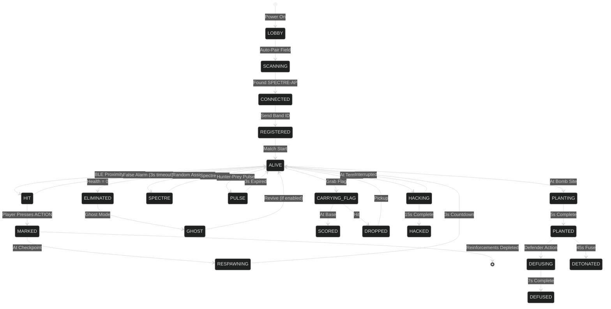
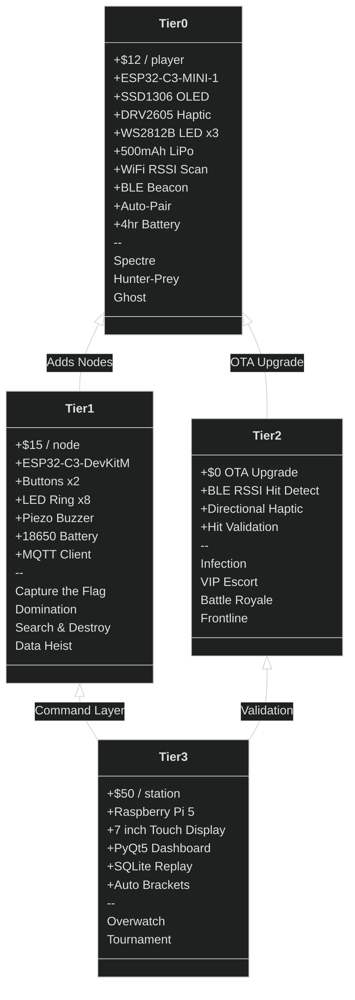
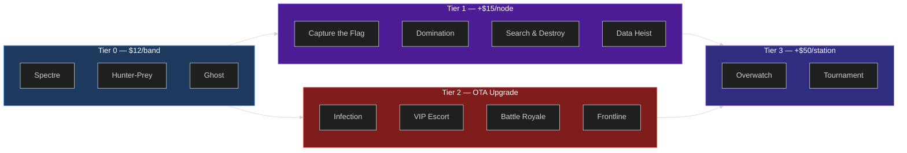
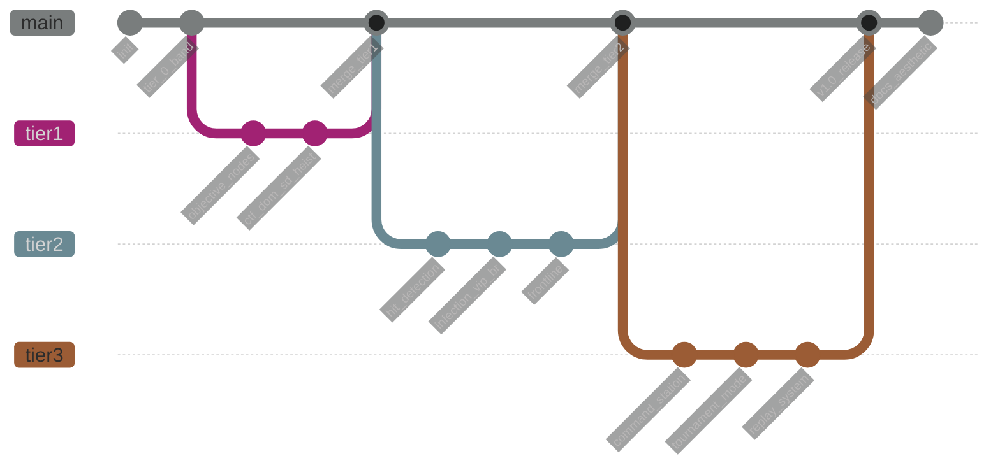

<!--
  ╔═══════════════════════════════════════════════════════════════╗
  ║  SPECTREBAND — Modular Paintball Game System                  ║
  ║  ESP32-C3 · BLE Mesh · FastAPI · WebSocket · SQLite           ║
  ╚═══════════════════════════════════════════════════════════════╝
-->

<h1 align="center">
  
  <br>SpectreBand
</h1>
<p align="center">
  <b>Real-time positioning · Wall-penetrating HUD · 13 game modes · $12/player</b>
</p>

<p align="center">
  <a href="#tiers"></a>
  <a href="#modes"></a>
  <a href="#bom"></a>
  <a href="#field-kit"></a>
  <a href="#"></a>
</p>

---

## Architecture

```mermaid
%%{init: {'theme': 'dark', 'themeVariables': { 'primaryColor': '#6366f1', 'edgeLabelBackground':'#1e1e2e', 'tertiaryColor': '#1e1e2e'}}}%%
flowchart TB
    subgraph FIELD["🎯 FIELD LAYER"]
        direction TB
        AP1["AP-01<br/>ESP32-C3<br/>Anchor"]:::ap
        AP2["AP-02<br/>Anchor"]:::ap
        AP3["AP-03<br/>Anchor"]:::ap
        AP4["AP-04<br/>Anchor"]:::ap
        AP5["AP-05<br/>Anchor"]:::ap
        AP6["AP-06<br/>Anchor"]:::ap
        NODE["Objective Node<br/>Buttons · OLED · LED Ring"]:::node
    end

    subgraph PLAYER["⌚ PLAYER LAYER"]
        direction LR
        BAND["SpectreBand<br/>ESP32-C3 · OLED · Haptic · LED"]:::band
        BLE["BLE Beacon<br/>Hit Detection"]:::ble
        WIFI["WiFi Scan<br/>RSSI Batch 5Hz"]:::wifi
    end

    subgraph SERVER["🖥️ SERVER LAYER"]
        direction TB
        FASTAPI["FastAPI<br/>WebSocket Hub"]:::server
        FUSION["Position Fusion<br/>Trilateration"]:::server
        SQLITE["SQLite<br/>Match Replay DB"]:::db
        MQTT["MQTT Broker<br/>Node State Sync"]:::server
    end

    subgraph COMMAND["🎮 COMMAND LAYER"]
        direction TB
        TABLET["Command Station<br/>7\" Touch · Pi 5"]:::cmd
        REFEREE["Referee View<br/>Live Map · Replay"]:::cmd
        BRACKET["Auto Brackets<br/>Tournament Gen"]:::cmd
    end

    WIFI -->|"RSSI Batch"| AP1 & AP2 & AP3 & AP4 & AP5 & AP6
    AP1 & AP2 & AP3 & AP4 & AP5 & AP6 -->|"MQTT"| FASTAPI
    BAND -->|"BLE Proximity<br/><2m = Hit"| BLE
    BLE -->|"Hit Event"| FASTAPI
    FASTAPI -->|"WebSocket<br/>Radar State 5Hz"| BAND
    FASTAPI -->|"Position"| FUSION
    FUSION -->|"Log"| SQLITE
    NODE -->|"MQTT"| MQTT
    MQTT -->|"State Sync"| FASTAPI
    FASTAPI -->|"WS"| TABLET
    TABLET -->|"Replay"| SQLITE
    TABLET -->|"Dispute"| REFEREE
    REFEREE -->|"Validate"| BRACKET

    classDef ap fill:#1e3a5f,stroke:#60a5fa,stroke-width:2px,color:#fff
    classDef band fill:#3f2e18,stroke:#f59e0b,stroke-width:2px,color:#fff
    classDef server fill:#1e1b4b,stroke:#818cf8,stroke-width:2px,color:#fff
    classDef db fill:#064e3b,stroke:#34d399,stroke-width:2px,color:#fff
    classDef node fill:#4c1d95,stroke:#a78bfa,stroke-width:2px,color:#fff
    classDef ble fill:#7f1d1d,stroke:#f87171,stroke-width:2px,color:#fff
    classDef wifi fill:#1e3a5f,stroke:#60a5fa,stroke-width:2px,color:#fff
    classDef cmd fill:#312e81,stroke:#c084fc,stroke-width:2px,color:#fff
```

---

## Game State Machine



---

## Tier System



---

## Data Flow

```mermaid
%%{init: {'theme': 'dark'}}%%
sequenceDiagram
    autonumber
    participant B as SpectreBand
    participant AP as AP Mesh
    participant S as Game Server
    participant N as Objective Node
    participant C as Command Station

    rect rgb(30, 27, 75)
        Note over B,AP: Positioning Loop (5Hz)
        B->>+AP: WiFi Scan (8 APs, RSSI)
        AP-->>-B: ACK
        AP->>S: MQTT: rssi_batch
        S->>S: Trilateration
        S->>B: WS: {position, visible, mode}
        B->>B: Render Radar HUD
    end

    rect rgb(76, 29, 149)
        Note over B,N: Objective Interaction
        B->>N: BLE Proximity (<3m)
        N->>N: Button Press Detected
        N->>S: MQTT: {node_id, event, progress}
        S->>S: Validate + Update State
        S->>N: MQTT: {state, owner, color}
        N->>N: Update LED Ring + OLED
        S->>B: WS: {mode_update, visible}
    end

    rect rgb(124, 45, 18)
        Note over B,S: Hit Detection
        B->>B: BLE Scan (nearby bands)
        B->>S: WS: {hit, target, rssi, timestamp}
        S->>S: Cross-Reference Position
        S->>B: WS: {hit_confirmed, direction}
        B->>B: Haptic Pattern + LED Flash
    end

    rect rgb(30, 58, 138)
        Note over S,C: Referee View
        S->>C: WS: {full_state, 10Hz}
        C->>C: Render Live Map
        C->>S: HTTP: Dispute Query
        S->>S: SQLite Replay (last 10s)
        S-->>C: JSON: {replay_data}
        C->>C: Show Both Perspectives
    end
```



---

## Mode Dependency Graph



---

## Git History



---

## Quick Start

```bash
# 1. Clone
git clone https://github.com/toxicwind/paintball-field.git
cd paintball-field

# 2. Deploy field server
cd field_server
pip install -r requirements.txt
python server.py --config field_layout.json --mode frontline

# 3. Flash Tier 0 band
cd ../tiers/tier_0_band/firmware
pio run --target upload --environment esp32c3

# 4. Flash Tier 1 objective node
cd ../../tier_1_objective/firmware
pio run --target upload --environment esp32c3
```

---

## Game Modes

| Tier | Cost | Modes |
|------|------|-------|
| **Tier 0** | $12/band | [Spectre](tiers/tier_0_band/modes/spectre/README.md) · [Hunter-Prey](tiers/tier_0_band/modes/hunter_prey/README.md) · [Ghost](tiers/tier_0_band/modes/ghost/README.md) |
| **Tier 1** | +$15/node | [Capture the Flag](tiers/tier_1_objective/modes/capture_flag/README.md) · [Domination](tiers/tier_1_objective/modes/domination/README.md) · [Search & Destroy](tiers/tier_1_objective/modes/search_destroy/README.md) · [Data Heist](tiers/tier_1_objective/modes/data_heist/README.md) |
| **Tier 2** | +$0 (OTA) | [Infection](tiers/tier_2_hitdetect/modes/infection/README.md) · [VIP Escort](tiers/tier_2_hitdetect/modes/vip_escort/README.md) · [Battle Royale](tiers/tier_2_hitdetect/modes/battle_royale/README.md) · [Frontline](tiers/tier_2_hitdetect/modes/frontline/README.md) |
| **Tier 3** | +$50/station | [Overwatch](tiers/tier_3_command/modes/overwatch/README.md) · [Tournament](tiers/tier_3_command/modes/tournament/README.md) |

---

## Hardware BOM

### SpectreBand (Tier 0) — $12/player

| Component | Part | Price | Purpose |
|-----------|------|-------|---------|
| MCU | ESP32-C3-MINI-1 | $2.50 | WiFi + BLE |
| Display | SSD1306 0.96" OLED | $1.50 | Radar HUD |
| Haptic | DRV2605L + ERM | $1.00 | Hit alerts |
| LEDs | WS2812B x3 | $0.30 | Team color |
| Battery | 502535 500mAh LiPo | $2.50 | 4hr runtime |
| Charger | MCP73831 + USB-C | $0.70 | Charging |
| PCB/Case/Strap | 30x40mm + TPU + NATO | $2.50 | Wrist-worn |
| Passives | 0402 R/C | $0.50 | Decoupling |
| **Total** | | **$12.00** | |

### Field Kit — $150

| Component | Qty | Unit | Total |
|-----------|-----|------|-------|
| AP Node (ESP32-C3) | 6 | $6 | $36 |
| Server (Raspberry Pi 5) | 1 | $80 | $80 |
| Router (GL.iNet) | 1 | $25 | $25 |
| Enclosures + Power | 6 | $7 | $42 |
| **Total** | | | **$183** |

---

## License

MIT. Build it. Sell it. Run a field.
